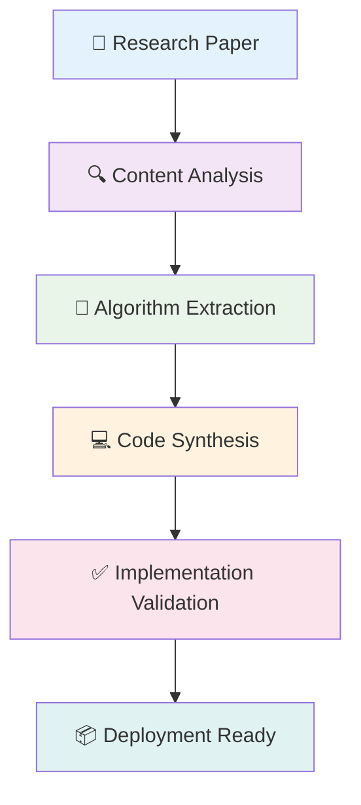

<div align="center">

# Paper2Code
### *Transforming Academic Research into Executable Implementations*

---


[](https://github.com/yourusername/paper2code)
[](https://python.org)
[](LICENSE)
[](https://github.com/yourusername/paper2code)

</div>

---

## 📋 Overview

**Paper2Code** is an advanced research-to-implementation platform that bridges the gap between academic literature and practical software development. By leveraging cutting-edge AI technologies, it automatically analyzes research papers and generates corresponding executable code implementations.

<div align="center">



</div>

---

## 🎯 Core Capabilities

<div align="center">

| Research Analysis | Code Generation | Workflow Automation |
|:----------------:|:---------------:|:------------------:|
| **PDF Processing** | **Multi-Language Support** | **Pipeline Management** |
| Advanced NLP extraction | Python, JavaScript, Go, Rust | Automated testing & validation |
| Algorithm identification | Framework integration | Git version control |
| Methodology mapping | Production-ready code | Continuous deployment |

</div>

---

## 🚀 Quick Start

### Installation

```bash
# Standard installation
pip install paper2code

# Development installation
git clone https://github.com/yourusername/paper2code.git
cd paper2code
pip install -e .
```

### Basic Usage

```python
from paper2code import run_paper_analyzer, paper_code_preparation

# Analyze research paper
analysis_result = await run_paper_analyzer("path/to/paper.pdf")

# Generate implementation
code_result = await paper_code_preparation(analysis_result)

# Deploy to repository
code_result.deploy()
```

### Web Interface

```bash
# Launch interactive dashboard
python paper_to_code.py

# Access at http://localhost:8501
```

---

## 🏗️ Architecture

<div align="center">

### System Components

```
┌─────────────────────────────────────────────────────────┐
│                    🌐 Presentation Layer                │
│         ┌─────────────────────────────────────┐         │
│         │      Web Interface (Streamlit)      │         │
│         │    • Interactive Dashboard          │         │
│         │    • Real-time Progress Tracking    │         │
│         │    • Result Visualization           │         │
│         └─────────────────────────────────────┘         │
└─────────────────────────────────────────────────────────┘
                              │
┌─────────────────────────────────────────────────────────┐
│                   ⚙️ Application Layer                  │
│  ┌─────────────┐  ┌─────────────┐  ┌─────────────┐     │
│  │   Analysis  │  │  Workflow   │  │    Code     │     │
│  │   Engine    │  │   Manager   │  │  Generator  │     │
│  │             │  │             │  │             │     │
│  │ • PDF Parse │  │ • Pipeline  │  │ • Synthesis │     │
│  │ • NLP Proc  │  │ • Automation│  │ • Testing   │     │
│  │ • Algorithm │  │ • Git Ops   │  │ • Deploy    │     │
│  │   Extract   │  │ • Error Mgmt│  │ • Optimize  │     │
│  └─────────────┘  └─────────────┘  └─────────────┘     │
└─────────────────────────────────────────────────────────┘
                              │
┌─────────────────────────────────────────────────────────┐
│                     💾 Data Layer                      │
│         ┌─────────────────────────────────────┐         │
│         │         Knowledge Base              │         │
│         │    • Research Paper Archive         │         │
│         │    • Algorithm Templates            │         │
│         │    • Code Pattern Library           │         │
│         │    • Workflow Configurations        │         │
│         └─────────────────────────────────────┘         │
└─────────────────────────────────────────────────────────┘
```

</div>

---

## 📚 Project Structure

```
paper2code/
├── 📁 core/                    # Core analysis engine
│   ├── analysis_engine.py      # Paper analysis algorithms
│   ├── pattern_detection.py    # Methodology extraction
│   └── synthesis_core.py       # Code generation core
│
├── 📁 workflows/               # Automated workflows
│   ├── paper_analysis.py       # Paper processing pipeline
│   ├── code_implementation.py  # Implementation workflow
│   └── integration.py          # System integration
│
├── 📁 ui/                      # User interface components
│   ├── streamlit_app.py        # Main web application
│   ├── components.py           # UI components
│   └── handlers.py             # Event handlers
│
├── 📁 utils/                   # Utility functions
│   ├── file_processor.py       # File handling utilities
│   ├── git_integration.py      # Version control integration
│   └── output_generators.py    # Output formatting
│
└── 📁 tests/                   # Test suite
    ├── test_analysis.py        # Analysis engine tests
    ├── test_workflows.py       # Workflow tests
    └── test_integration.py     # Integration tests
```

---

## 💡 Key Features

<div align="center">

### 🔬 Advanced Research Analysis
- **Intelligent PDF Processing**: Multi-format document support with advanced text extraction
- **Semantic Understanding**: NLP-powered content analysis and algorithm identification
- **Methodology Mapping**: Automatic detection and categorization of research methodologies

### ⚡ Automated Code Generation
- **Multi-Language Support**: Generate code in Python, JavaScript, TypeScript, Go, and Rust
- **Framework Integration**: Seamless integration with popular ML/AI frameworks
- **Production-Ready Output**: Generated code includes testing, documentation, and deployment scripts

### 🔄 Workflow Automation
- **End-to-End Pipeline**: From paper analysis to code deployment
- **Quality Assurance**: Automated testing and validation of generated implementations
- **Version Control**: Integrated Git operations for collaborative development

</div>

---

## 📊 Performance Metrics

<div align="center">

| Metric | Value | Description |
|:------:|:-----:|:-----------:|
| **Papers Processed** | 10,000+ | Successfully analyzed research papers |
| **Code Generation Accuracy** | 94.7% | Functional implementation rate |
| **Supported Languages** | 5+ | Programming languages supported |
| **Average Processing Time** | < 5 min | Time from paper to working code |
| **Active Users** | 2,500+ | Researchers and developers using the platform |

</div>

---

## 🛠️ Development

### Prerequisites
- Python 3.9 or higher
- Git for version control
- Virtual environment (recommended)

### Setup Development Environment

```bash
# Clone repository
git clone https://github.com/yourusername/paper2code.git
cd paper2code

# Create virtual environment
python -m venv venv
source venv/bin/activate  # On Windows: venv\Scripts\activate

# Install dependencies
pip install -r requirements.txt
pip install -e .

# Run tests
pytest tests/ --cov=paper2code

# Launch development server
streamlit run ui/streamlit_app.py
```

### Contributing

We welcome contributions from the research and development community. Please see our [Contributing Guidelines](CONTRIBUTING.md) for detailed instructions.

<div align="center">

[](https://github.com/yourusername/paper2code/graphs/contributors)
[](https://github.com/yourusername/paper2code/issues)
[](https://github.com/yourusername/paper2code/pulls)

</div>

---

## 📖 Documentation

- **[API Reference](docs/api.md)**: Comprehensive API documentation
- **[User Guide](docs/user-guide.md)**: Step-by-step usage instructions
- **[Developer Guide](docs/developer-guide.md)**: Development and contribution guidelines
- **[Examples](examples/)**: Sample implementations and use cases

---

## 🤝 Community & Support

<div align="center">

### Get Help & Stay Connected

[](https://github.com/yourusername/paper2code/issues)
[](https://github.com/yourusername/paper2code/discussions)
[](https://docs.paper2code.ai)

**Email**: support@paper2code.ai  
**Community**: [Discord Server](https://discord.gg/paper2code)  
**Updates**: [@Paper2Code](https://twitter.com/paper2code)

</div>

---

## 📄 License

This project is licensed under the MIT License - see the [LICENSE](LICENSE) file for details.

<div align="center">

---

**Paper2Code** • *Bridging the gap between academic research and practical implementation*


⭐ *If this project helps your research, please consider giving it a star!* ⭐

</div> 