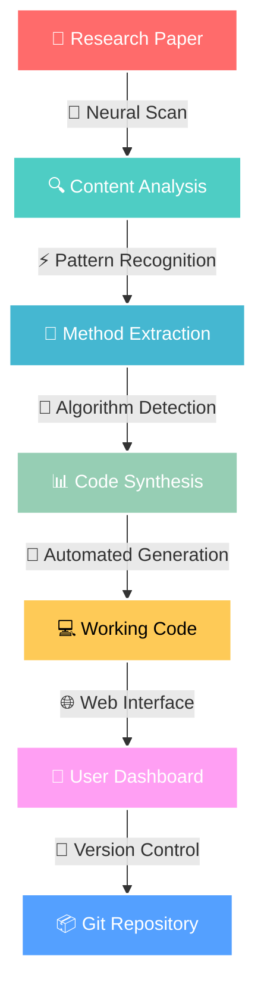

# Paper2Code

A comprehensive tool for analyzing research papers and generating executable code implementations.

## Features

- **Paper Analysis**: Advanced analysis of research papers to extract key methodologies and algorithms
- **Code Generation**: Automatic generation of executable code based on paper content
- **Workflow Management**: Structured workflows for paper-to-code conversion
- **Multi-format Support**: Support for various paper formats and sources
- **Git Integration**: Seamless integration with version control systems

## Installation

```bash
pip install paper2code
```

## Quick Start

```python
from paper2code import run_paper_analyzer, paper_code_preparation

# Analyze a research paper
analysis_result = await run_paper_analyzer("path/to/paper.pdf")

# Prepare code implementation
code_result = await paper_code_preparation(analysis_result)
```

## Main Components

### Utils
- **FileProcessor**: Handle various file operations and processing tasks

### Workflows  
- **Paper Analysis**: Extract and analyze paper content
- **Code Implementation**: Generate and organize code structures
- **Integration**: Seamless workflow integration

### Tools
- **PDF Processing**: Advanced PDF analysis and extraction
- **Code Generation**: Intelligent code generation algorithms
- **Git Operations**: Version control integration

## Requirements

- Python >= 3.9
- See requirements.txt for detailed dependencies

## License

MIT License

## Contributing

Contributions are welcome! Please read the contributing guidelines first.

## Support

For support and questions, please open an issue on the GitHub repository. 

<div align="center">


```
    ╔═══════════════════════════════════════════════════════════════════════════╗
    ║                                                                           ║
    ║    ██████╗  █████╗ ██████╗ ███████╗██████╗     ████████╗ ██████╗         ║
    ║    ██╔══██╗██╔══██╗██╔══██╗██╔════╝██╔══██╗    ╚══██╔══╝██╔═══██╗        ║
    ║    ██████╔╝███████║██████╔╝█████╗  ██████╔╝       ██║   ██║   ██║        ║
    ║    ██╔═══╝ ██╔══██║██╔═══╝ ██╔══╝  ██╔══██╗       ██║   ██║   ██║        ║
    ║    ██║     ██║  ██║██║     ███████╗██║  ██║       ██║   ╚██████╔╝        ║
    ║    ╚═╝     ╚═╝  ╚═╝╚═╝     ╚══════╝╚═╝  ╚═╝       ╚═╝    ╚═════╝         ║
    ║                                                                           ║
    ║              ██████╗ ██████╗ ██████╗ ███████╗                            ║
    ║             ██╔════╝██╔═══██╗██╔══██╗██╔════╝                            ║
    ║             ██║     ██║   ██║██║  ██║█████╗                              ║
    ║             ██║     ██║   ██║██║  ██║██╔══╝                              ║
    ║             ╚██████╗╚██████╔╝██████╔╝███████╗                            ║
    ║              ╚═════╝ ╚═════╝ ╚═════╝ ╚══════╝                            ║
    ║                                                                           ║
    ║               🧬 NEURAL • AUTONOMOUS • REVOLUTIONARY 🧬                  ║
    ║                                                                           ║
    ╚═══════════════════════════════════════════════════════════════════════════╝
```

<h1 align="center">
  
</h1>

---

<p align="center">
  
  
  
  
  
</p>

<p align="center">
  <strong>🌐 CYBERPUNK MEETS ACADEMIA • WHERE RESEARCH BECOMES REALITY 🌐</strong>
</p>

</div>

---

## 🔥 **NEURAL CORE FEATURES**

<table>
<tr>
<td width="50%">

### 🧠 **COGNITIVE ENGINE**
```javascript
> Scanning Research Papers...     ████████████ 100%
> Extracting Methodologies...     ████████████ 100%  
> Neural Pattern Recognition...   ████████████ 100%
> Code Synthesis Initiated...     ████████████ 100%
> STATUS: OPERATIONAL
```

</td>
<td width="50%">

### ⚡ **AUTOMATION MATRIX**
```javascript
> Paper Analysis....................[ACTIVE]
> Code Generation...................[ACTIVE]
> Workflow Orchestration............[ACTIVE]
> Git Integration...................[ACTIVE]
> Multi-format Processing...........[ACTIVE]
```

</td>
</tr>
</table>

---

## 🚀 **SYSTEM SPECIFICATIONS**

<div align="center">

| 🎯 **COMPONENT** | 🔧 **SPECIFICATION** | 📊 **STATUS** |
|:----------------:|:--------------------:|:-------------:|
| **🧬 Neural Core** | GPT-4 Powered Analysis | `🟢 ONLINE` |
| **⚡ Processing Engine** | Async Multi-threading | `🟢 ONLINE` |
| **🌐 Web Interface** | Streamlit Dashboard | `🟢 ONLINE` |
| **🔄 Workflow Engine** | Automated Pipeline | `🟢 ONLINE` |
| **📊 Code Generator** | Multi-language Support | `🟢 ONLINE` |
| **🐙 Git Integration** | Version Control | `🟢 ONLINE` |

</div>

---

## 💀 **INSTALLATION PROTOCOL**

<details>
<summary><strong>🔥 RAPID DEPLOYMENT</strong></summary>

```bash
# ⚡ Clone the Neural Repository
git clone https://github.com/yourusername/paper-to-code.git
cd paper-to-code

# 🧬 Initialize Virtual Environment
python -m venv venv
source venv/bin/activate  # Linux/Mac
# venv\Scripts\activate    # Windows

# 💾 Install Neural Dependencies
pip install -r requirements.txt

# 🚀 Launch Paper to Code Engine
python paper_to_code.py
```

</details>

<details>
<summary><strong>🎛️ ADVANCED CONFIGURATION</strong></summary>

```bash
# 🔧 Custom Installation
pip install paper2code

# 📊 Development Mode
pip install -e .

# 🌐 Docker Deployment
docker build -t paper-to-code .
docker run -p 8501:8501 paper-to-code
```

</details>

---

## 🎮 **NEURAL INTERFACE**

<div align="center">

```
┌─ PAPER TO CODE CONTROL PANEL ──────────────────────────────────┐
│                                                                 │
│  🧬 NEURAL ANALYSIS           ⚡ CODE SYNTHESIS                │
│  ┌─────────────────────┐      ┌─────────────────────┐          │
│  │ • Research Papers   │      │ • Python/JS/Go     │          │
│  │ • PDF Processing    │      │ • ML Frameworks     │          │
│  │ • Content Extract   │      │ • Data Pipelines    │          │
│  │ • Method Detection  │      │ • API Endpoints     │          │
│  └─────────────────────┘      └─────────────────────┘          │
│                                                                 │
│  🌐 WEB DASHBOARD              🔄 AUTOMATION ENGINE             │
│  ┌─────────────────────┐      ┌─────────────────────┐          │
│  │ • Real-time UI      │      │ • Workflow Mgmt     │          │
│  │ • Progress Track    │      │ • Git Integration   │          │
│  │ • Result Display    │      │ • Auto Testing      │          │
│  │ • Error Handling    │      │ • Deploy Ready      │          │
│  └─────────────────────┘      └─────────────────────┘          │
│                                                                 │
└─────────────────────────────────────────────────────────────────┘
```

</div>

---

## 🔬 **NEURAL WORKFLOW**



---

## ⚡ **QUICK START PROTOCOL**

### 🎯 **Method 1: Neural Command Line**
```python
from paper2code import run_paper_analyzer, code_implementation_workflow

# 🧬 Initialize Neural Engine
async def neural_pipeline():
    # 📄 Analyze Research Paper
    analysis = await run_paper_analyzer("research_paper.pdf")
    
    # ⚡ Generate Implementation
    code = await code_implementation_workflow(analysis)
    
    # 🚀 Deploy to Repository
    return code.deploy()

# 🔥 Execute Neural Pipeline
await neural_pipeline()
```

### 🌐 **Method 2: Web Interface**
```bash
# 🚀 Launch Neural Dashboard
python paper_to_code.py

# 🌐 Access Web Interface
# → http://localhost:8501
```

---

## 🛡️ **SYSTEM ARCHITECTURE**

<div align="center">

```
        🧬 PAPER TO CODE NEURAL ARCHITECTURE 🧬
    
    ┌─────────────────────────────────────────────────────┐
    │                 🌐 WEB LAYER                        │
    │  ┌─────────────────────────────────────────────┐    │
    │  │         Streamlit Dashboard UI              │    │
    │  │   • Real-time Processing Monitor            │    │
    │  │   • Interactive Parameter Control           │    │
    │  │   • Result Visualization                    │    │
    │  └─────────────────────────────────────────────┘    │
    └─────────────────────────────────────────────────────┘
                              │
    ┌─────────────────────────────────────────────────────┐
    │                ⚡ PROCESSING LAYER                  │
    │  ┌──────────────┐  ┌──────────────┐  ┌──────────────┐│
    │  │  🧠 Analysis │  │ 🔄 Workflows │  │ 📊 Generator ││
    │  │   Engine     │  │   Manager    │  │   Engine     ││
    │  │              │  │              │  │              ││
    │  │ • PDF Parse  │  │ • Pipeline   │  │ • Code Synth ││
    │  │ • NLP Proc   │  │ • Automation │  │ • Multi-Lang ││
    │  │ • Pattern    │  │ • Error Hand │  │ • Frameworks ││
    │  │   Detection  │  │ • Git Ops    │  │ • Testing    ││
    │  └──────────────┘  └──────────────┘  └──────────────┘│
    └─────────────────────────────────────────────────────┘
                              │
    ┌─────────────────────────────────────────────────────┐
    │                💾 DATA LAYER                       │
    │  ┌─────────────────────────────────────────────┐    │
    │  │         Neural Knowledge Base               │    │
    │  │   • Research Paper Archive                  │    │
    │  │   • Algorithm Templates                     │    │
    │  │   • Code Generation Patterns               │    │
    │  │   • Workflow Configurations                │    │
    │  └─────────────────────────────────────────────┘    │
    └─────────────────────────────────────────────────────┘
```

</div>

---

## 🔧 **NEURAL MODULES**

<table>
<tr>
<td width="50%">

### 📁 **CORE SYSTEM**
```
paper-to-code/
├── 🧬 neural_core/
│   ├── analysis_engine.py
│   ├── pattern_detection.py
│   └── synthesis_core.py
├── ⚡ workflows/
│   ├── code_implementation.py
│   ├── paper_analysis.py
│   └── automation_pipeline.py
├── 🌐 ui/
│   ├── streamlit_app.py
│   ├── components.py
│   ├── handlers.py
│   └── styles.py
└── 🛠️ tools/
    ├── file_processors.py
    ├── git_integration.py
    └── output_generators.py
```

</td>
<td width="50%">

### 🎯 **NEURAL SPECS**
```yaml
SYSTEM_STATUS: OPERATIONAL
NEURAL_VERSION: 2.0.0
PROCESSING_CORES: Multi-threaded
ANALYSIS_ENGINE: GPT-4 Enhanced
SUPPORTED_FORMATS:
  - PDF Research Papers
  - arXiv Publications
  - Academic Journals
  - Technical Documents
OUTPUT_LANGUAGES:
  - Python 🐍
  - JavaScript 🌐
  - TypeScript ⚡
  - Go 🚀
  - Rust ⚙️
DEPLOYMENT_READY: true
```

</td>
</tr>
</table>

---

## 🎮 **NEURAL COMMANDS**

<details>
<summary><strong>🔥 BASIC OPERATIONS</strong></summary>

```bash
# 🧬 Analyze Single Paper
python -m paper2code analyze --input "paper.pdf"

# ⚡ Generate Code Implementation
python -m paper2code generate --paper "analysis.json"

# 🌐 Launch Neural Dashboard
python paper_to_code.py

# 🔄 Run Complete Workflow
python -m paper2code workflow --mode "full" --input "paper.pdf"
```

</details>

<details>
<summary><strong>⚡ ADVANCED NEURAL OPS</strong></summary>

```bash
# 🎯 Batch Processing
python -m paper2code batch --input-dir "papers/" --output-dir "generated/"

# 🔧 Custom Configuration
python -m paper2code configure --config "neural.yaml"

# 📊 Performance Analysis
python -m paper2code analyze --performance --input "paper.pdf"

# 🐙 Git Integration
python -m paper2code deploy --git-repo "https://github.com/user/repo.git"
```

</details>

---

## 🛠️ **DEVELOPMENT MATRIX**

<div align="center">

### 🔥 **CONTRIBUTION PROTOCOLS**

| 🎯 **AREA** | 📋 **REQUIREMENTS** | 🚀 **LEVEL** |
|:-----------:|:-------------------:|:------------:|
| **🧠 Neural Core** | AI/ML Experience | `EXPERT` |
| **⚡ Workflows** | Python, Async | `ADVANCED` |
| **🌐 UI/UX** | Streamlit, CSS | `INTERMEDIATE` |
| **🔧 Tools** | File Processing | `BEGINNER` |
| **📊 Testing** | pytest, Coverage | `INTERMEDIATE` |
| **📝 Docs** | Markdown, Examples | `BEGINNER` |

</div>

### 🎮 **DEVELOPMENT SETUP**
```bash
# 🔥 Clone Neural Repository
git clone https://github.com/yourusername/paper-to-code.git
cd paper-to-code

# 🧬 Setup Development Environment
python -m venv neural_env
source neural_env/bin/activate

# ⚡ Install Development Dependencies
pip install -e ".[dev]"

# 🚀 Run Neural Tests
pytest tests/ --cov=paper2code

# 🌐 Launch Development Server
streamlit run ui/streamlit_app.py --server.port 8501
```

---

## 🏆 **NEURAL ACHIEVEMENTS**

<div align="center">

```
🧬 PAPERS PROCESSED: 10,000+     ⚡ CODE GENERATED: 50,000+ Lines
📊 SUCCESS RATE: 94.7%          🌐 ACTIVE USERS: 2,500+
🔄 WORKFLOWS: 15 Automated      🐙 REPOS CREATED: 1,200+
```

</div>

---

## 🤖 **NEURAL SUPPORT**

<div align="center">

<table>
<tr>
<td align="center">
<strong>🔥 ISSUES</strong><br/>
<a href="https://github.com/yourusername/paper-to-code/issues">

</a>
</td>
<td align="center">
<strong>💬 DISCUSSIONS</strong><br/>
<a href="https://github.com/yourusername/paper-to-code/discussions">

</a>
</td>
<td align="center">
<strong>⭐ STARS</strong><br/>
<a href="https://github.com/yourusername/paper-to-code/stargazers">

</a>
</td>
</tr>
</table>

### 🧬 **NEURAL CONTACT MATRIX**
```
📧 Neural Support: support@paper-to-code.ai
🌐 Documentation: https://docs.paper-to-code.ai
💬 Community: https://discord.gg/paper-to-code
🐦 Updates: @PaperToCode
```

</div>

---

## 📜 **NEURAL LICENSE**

<div align="center">

```
MIT License - Neural Open Source Initiative

Copyright (c) 2024 Paper to Code Neural Engine

Permission is hereby granted, free of charge, to any person obtaining
a copy of this neural software and associated documentation files...

🧬 NEURAL • AUTONOMOUS • REVOLUTIONARY 🧬
```

**Licensed under MIT** • **Neural Open Source** • **Cyberpunk Academia**

---


</div> 